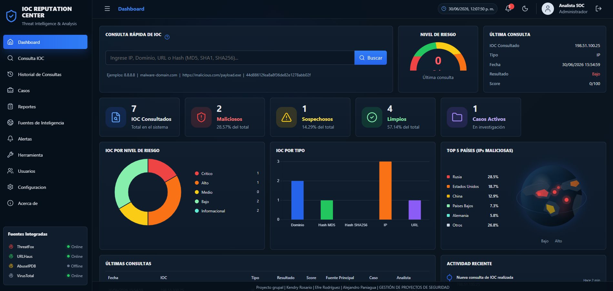
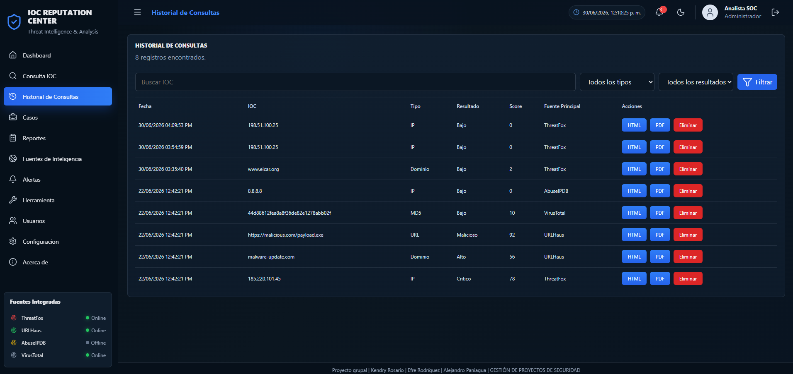
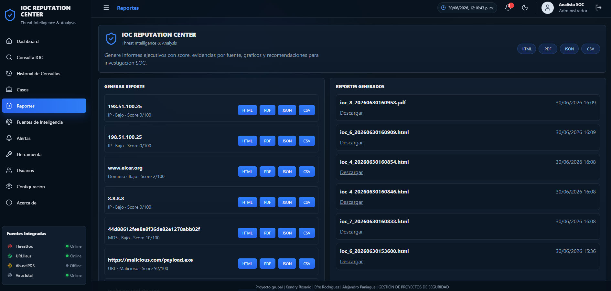
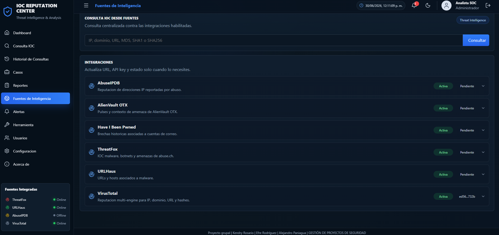

# IOC Reputation Center

**Threat Intelligence & IOC Analysis Platform**

IOC Reputation Center es una herramienta defensiva para equipos SOC. Permite consultar la reputacion de IPs, dominios, URLs y hashes, registrar historial, clasificar riesgo, crear casos de investigacion y generar reportes.

## Desarrollador

**Kendry Rosario**  
Lic. en Tecnologia de la Informacion con maestria en Ciberseguridad  
Contacto: **kendry.rosario@gmail.com**

## Imagenes de apoyo






## Fuentes de consulta IOC

Cada consulta de IOC se procesa contra estas plataformas:

- ThreatFox
- URLHaus
- AbuseIPDB
- VirusTotal

ThreatFox y URLHaus pueden consultarse sin API key. AbuseIPDB y VirusTotal requieren llaves configuradas en `.env` o desde la pantalla `/fuentes`.

Cuando una fuente no aplica para un tipo de IOC, la herramienta registra el resultado como `No aplica`. Cuando falta una API key, registra `Sin API key` sin detener la consulta completa.

## Stack

- Python 3.11+
- FastAPI
- SQLite por defecto
- PostgreSQL opcional mediante `DATABASE_URL`
- SQLAlchemy
- Jinja2
- Bootstrap 5
- Chart.js
- Requests / HTTPX

## Instalacion rapida en Windows

```powershell
cd C:\xampp\htdocs\IOC-reputation-center
python -m venv .venv
.\.venv\Scripts\Activate.ps1
pip install -r requirements.txt
Copy-Item .env.example .env
python run.py
```

Si PowerShell bloquea la activacion del entorno virtual:

```powershell
Set-ExecutionPolicy -Scope Process -ExecutionPolicy Bypass
.\.venv\Scripts\Activate.ps1
```

Acceso local:

```text
http://127.0.0.1:8000
```

Acceso desde otra maquina de la misma red:

```powershell
uvicorn app.main:app --reload --host 0.0.0.0 --port 8000
```

Luego abrir:

```text
http://IP_DEL_SERVIDOR:8000
```

## Instalacion rapida en Kali Linux / Ubuntu

Instalacion automatica:

```bash
git clone <url-del-repositorio>
cd IOC-reputation-center
chmod +x install_linux.sh
./install_linux.sh
source .venv/bin/activate
uvicorn app.main:app --reload --host 127.0.0.1 --port 8000
```

Instalacion manual:

```bash
sudo apt update
sudo apt install python3 python3-pip python3-venv git build-essential python3-dev libffi-dev libcairo2 libpango-1.0-0 libpangoft2-1.0-0 libgdk-pixbuf-2.0-0 shared-mime-info -y
git clone <url-del-repositorio>
cd IOC-reputation-center
python3 -m venv .venv
source .venv/bin/activate
pip install -r requirements.txt
cp .env.example .env
uvicorn app.main:app --reload --host 127.0.0.1 --port 8000
```

## Credenciales iniciales

```text
Email: analista@soc.local
Password: admin123
Rol: Administrador
```

## Configuracion de API keys

Editar `.env`:

```env
ABUSEIPDB_API_KEY=su_clave
VIRUSTOTAL_API_KEY=su_clave
```

Tambien puede configurarse desde:

```text
/fuentes
```

## Funciones principales

- Dashboard SOC con indicadores y estado de fuentes.
- Consulta rapida de IP, dominio, URL, MD5, SHA1 y SHA256.
- Consulta contra ThreatFox, URLHaus, AbuseIPDB y VirusTotal.
- Motor de riesgo de 0 a 100.
- Historial persistente en SQLite.
- Gestion de casos de investigacion.
- Reportes HTML, PDF, JSON y CSV.
- Auditoria basica en `logs/audit.log`.
- Login web con sesion local.
- Gestion de usuarios por rol.
- Configuracion web de fuentes de inteligencia.

## Roles

- Administrador: acceso completo y creacion de usuarios.
- Supervisor SOC: operacion y revision.
- Analista SOC: consultas, casos y reportes.
- Solo lectura: consulta de informacion sin administracion.

## Clasificacion de riesgo

- 0-20: Bajo
- 21-40: Moderado
- 41-60: Alto
- 61-80: Critico
- 81-100: Malicioso

## Estructura

```text
app/
  main.py
  database.py
  config.py
  models.py
  schemas.py
  routers/
  services/
  templates/
  static/
docs/
exports/
reports/
requirements.txt
run.py
.env.example
.gitignore
```

## Endpoints utiles

- `GET /` Dashboard
- `GET /consulta` Consulta IOC
- `POST /api/ioc` Consulta JSON
- `GET /historial` Historial
- `GET /casos` Casos
- `GET /reportes` Reportes
- `GET /fuentes` Integraciones y consulta por fuentes
- `GET /usuarios` Administracion y edicion de usuarios
- `GET /health` Estado basico
- `GET /docs` Documentacion OpenAPI

## Preparacion para Git

El repositorio ya incluye `.gitignore` para excluir `.env`, entornos virtuales, bases SQLite locales, logs y reportes generados.

```bash
git init
git add .
git commit -m "Initial release of IOC Reputation Center"
git branch -M main
git remote add origin <url-del-repositorio>
git push -u origin main
```

Antes de subir, confirme que no existan secretos reales en `.env` ni en archivos generados.

## Documentacion adicional

- [Guia de instalacion](docs/INSTALACION.md)
- [Guia de uso](docs/GUIA_USO.md)
- [Preparacion del repositorio Git](docs/GIT_REPOSITORIO.md)
